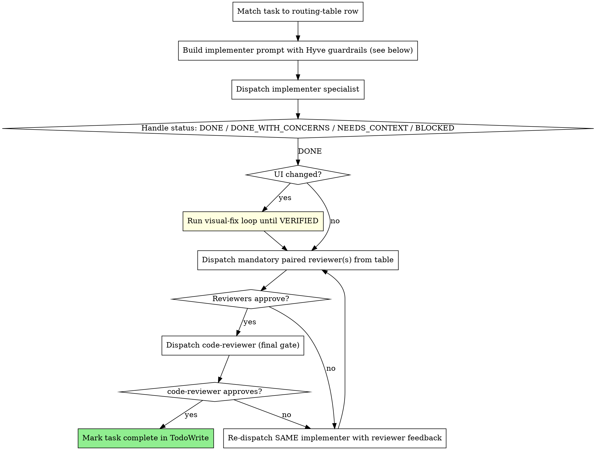

<SUBAGENT-STOP>
If you were dispatched as a subagent, skip this skill — your parent already routed you and picked your reviewers.
</SUBAGENT-STOP>

<EXTREMELY-IMPORTANT>
This codebase has **13 specialized agents** in `.claude/agents/`. Each one:

- Declares the skills it depends on (in its frontmatter)
- Owns a specific file domain
- Has known review gates that must run after its changes

If the main session writes code that one of these specialists owns, **all of that declared discipline is bypassed**. The agents are not optional helpers — they are the disciplined path. The main session is the conductor, never the player.

**The rule:** if a routing-table row matches the file you're about to touch, dispatch the specialist. Do not implement it inline.
</EXTREMELY-IMPORTANT>

## The Pattern (Layered on `superpowers:subagent-driven-development`)

This skill **extends**, not replaces, `superpowers:subagent-driven-development`. The general pattern (fresh subagent per task, spec review then quality review, continuous execution, status handling) all applies. What this skill adds:

1. **Implementer selection is constrained by a routing table** — not "any subagent", *the right specialist*.
2. **Quality-review stage is specialist-driven** — `ui-design-reviewer` for UI, `security-reviewer` for backend integration, `accessibility-auditor` for interactive widgets, `performance-optimizer` when the change touches hot paths.
3. **Visual changes trigger the `visual-fix` loop** — non-negotiable, Stop-hook enforced.
4. **Hyve guardrails are injected into every implementer prompt** — Product Test, no `any`, RSC default, Zod validation, design tokens.

## Implementer Routing Table

Match the file or task to the specialist. **If a row matches, you do not implement inline.**

| If the task touches… | Dispatch |
|---|---|
| New/modified component in `src/components/**/*.tsx` or `src/app/**/*.tsx` | `ui-component-dev` |
| `src/components/ui/**`, `tailwind.config`, OKLCH tokens, theme vars | `design-system` |
| `src/app/**` — `page.tsx`, `layout.tsx`, `loading.tsx`, `error.tsx`, `middleware.ts`, route groups, dynamic routes | `routing-nav` |
| `src/lib/api/**`, Server Actions, SWR hooks, fetches to Rust backend, Zod schemas | `api-integration` |
| `useState` / `useReducer` / Context / form state / prop-drilling refactor | `state-management` |
| `*.test.ts(x)` / `*.spec.ts(x)` (Vitest + RTL) | `unit-tester` |
| `tests/e2e/**`, `playwright.config`, user-journey tests | `e2e-tester` |
| `next.config.ts`, `vercel.json`/`vercel.ts`, `.env*`, `.github/workflows/**` | `build-deploy` |
| `README.md`, `CLAUDE.md`, `AGENTS.md`, ADRs, JSDoc, `docs/**` | `docs-writer` |

**Ambiguity rules:**
- If a change spans multiple domains (e.g. a new page that fetches data and adds state) — dispatch the **primary** specialist first, let them sequence the rest. The primary is usually the file type you're creating, not the data you're wiring.
- If no row matches, ask the user before implementing inline. A missing row may mean a new specialist is needed.

## Mandatory Reviewer Pairings

After every successful implementation, dispatch the reviewer(s) for the change type. These **stack** — a UI change that also touches an API route gets both.

| If the change includes… | Required reviewer |
|---|---|
| Any `.tsx` component or page change | `ui-design-reviewer` (takes Playwright screenshot — mandatory) |
| Forms, modals, dropdowns, menus, focus management, keyboard interaction | `accessibility-auditor` |
| `src/lib/api/**`, auth, env vars, cookies, sessions, user input, external API calls | `security-reviewer` |
| Heavy imports, large lists, animations, hot rendering paths | `performance-optimizer` |
| **Any code change** (always last) | `code-reviewer` |

The visual gate is special: any UI change must **also** pass `visual-fix`'s screenshot loop. The Stop hook in `.claude/settings.json` will block completion otherwise.

## Per-Task Pipeline

For each task in the plan (extracted upfront into TodoWrite, same as `subagent-driven-development`):



## Hyve Guardrails — Inject Into Every Implementer Prompt

When you dispatch an implementer, the prompt **must** include these constraints (the specialist's frontmatter lists its skills, but these are project-level rules every implementer obeys):

```
PROJECT CONSTRAINTS (non-negotiable):
1. PRODUCT TEST — this is operator tooling for fund originators. Not analytics,
   not intelligence, not an oracle UI. If your change invites a human to read,
   interpret, or analyze data, stop and surface it as ambiguous.
2. TypeScript strict — never `any`, use `unknown` and narrow.
3. Server Components by default — add `"use client"` only when interactivity,
   browser APIs, or hooks require it. Justify every `"use client"`.
4. All Rust API responses validated through Zod in src/lib/api/schemas.ts.
5. No hardcoded colors/spacing/type — use OKLCH design tokens. If you need a
   new token, request it from `design-system` instead of inlining.
6. Named exports only (pages/layouts excepted).
7. App Router only — no Pages Router patterns.
8. This Next.js may differ from training data — check node_modules/next/dist/docs/
   before applying conventions.

After implementing, report status: DONE / DONE_WITH_CONCERNS / NEEDS_CONTEXT / BLOCKED.
Do not commit unless the user already authorized commits for this task.
```

## Model Selection (Hyve-Specific)

Same principle as `subagent-driven-development`, with these Hyve-specific signals:

- **Sonnet** is the default for most specialists — `ui-component-dev`, `routing-nav`, `state-management`, `api-integration`, `design-system`, etc.
- **Opus** is reserved for `code-reviewer`, `security-reviewer`, `performance-optimizer` — they need broad judgment.
- **Haiku** is fine for `docs-writer` and mechanical token additions in `design-system`.

The agent files already declare `model:` in their frontmatter. Don't override unless the task is unusually complex or simple.

## Status Handling

Same four statuses as `subagent-driven-development`. Hyve-specific notes:

- **`NEEDS_CONTEXT`** — most often a missing Rust API contract or a missing design token. Resolve by reading `docs/product/hyve_originator_context.md` or `src/lib/api/schemas.ts`, or by dispatching `api-integration` / `design-system` to produce the missing piece first.
- **`BLOCKED`** — if blocked on an unclear product requirement, surface to user with the Product Test framing ("would a fund operator use this to configure or monitor?").

## When NOT to Use This Skill

The dispatch overhead isn't always worth it:

- **Trivial one-liners** — typo fixes, removing a dead import, renaming a local variable. Main session can do these.
- **Investigation / research** — reading code to answer a question. Use `Explore` agent or just `Read`.
- **Conversation about approach** — use `superpowers:brainstorming` first; this skill is execution.
- **Single-file pure utility** with a complete spec — main session can implement; still run `code-reviewer` after.

If you're unsure, lean toward dispatching. The wasted dispatch on a small task is cheaper than the silent skill-skip on a real one.

## Red Flags

| Thought | Reality |
|---|---|
| "I'll just edit this `.tsx` myself, it's small" | The specialist has skills the main session won't auto-invoke. Dispatch. |
| "I'll inline this color, refactor into tokens later" | "Later" never comes. `design-system` first. |
| "I'll add the Zod schema after I confirm the shape" | Then you're shipping unvalidated parsing. `api-integration` adds both together. |
| "The UI change is too small to warrant `ui-design-reviewer`" | The Stop hook will block you anyway. Run it. |
| "I'll just `'use client'` this whole layout to unblock the hook error" | Find the actual interactive leaf. Use `routing-nav` or `state-management`. |
| "I'll skip `security-reviewer`, the api change is internal" | Internal ≠ safe. If it touches `src/lib/api/`, run security review. |
| "I'll cast to `any` to unblock the type error" | Never. `unknown` and narrow. |
| "I already know what `ui-component-dev` will say" | You don't. The agent reads the current files and follows the current skills. |
| "Let me dispatch three implementers in parallel" | Conflicts. One implementer at a time per task. |
| "I'll let the implementer commit and push" | Implementers don't push; the controller decides when to finish via `superpowers:finishing-a-development-branch`. |

## Integration

- **`superpowers:subagent-driven-development`** — the base pattern this layers on. Read it once; this skill is the Hyve specialization.
- **`superpowers:writing-plans`** — produces the plan this skill executes.
- **`superpowers:brainstorming`** — run first when scope is unclear; this skill is execution, not exploration.
- **`visual-fix`** — invoked automatically by the pipeline for any UI change.
- **`using-hyve`** — orientation skill (what the project is, what each agent does). This skill is the *how*.
- **`superpowers:requesting-code-review`** — template the final `code-reviewer` dispatch uses.
- **`superpowers:finishing-a-development-branch`** — invoked after all tasks complete.

## Example

```
User: Build the dataset filter sidebar on /v2/vaults/[id]/data per the plan in
       docs/plans/dataset-filters.md.

You: Using hyve-driven-development to execute this plan.

[Read plan, extract 4 tasks into TodoWrite]

Task 1: Add `DatasetFilter` Zod schema + types

[Routing table → src/lib/api/** → api-integration]
[Dispatch api-integration with Hyve guardrails injected]
api-integration: DONE — added schema, types, narrowed response.

[No UI change → skip visual-fix]
[Reviewer pairings: security-reviewer (touches api/), then code-reviewer]
security-reviewer: ✅ No exposed PII, schema rejects unknown keys.
code-reviewer: ✅ Approved.
[Mark Task 1 complete]

Task 2: Add `<DatasetFilterPanel>` component

[Routing table → src/components/** → ui-component-dev]
[Dispatch ui-component-dev — declared skills include frontend-design,
 vercel-composition-patterns, vercel-react-best-practices, typescript-advanced-types,
 web-design-guidelines]
ui-component-dev: DONE — RSC by default, client subcomponent for filter state.

[UI changed → run visual-fix loop]
[Iteration 1: spacing of chips off, fix, screenshot — VERIFIED]

[Reviewer pairings: ui-design-reviewer (mandatory), accessibility-auditor
 (has form controls), code-reviewer]
ui-design-reviewer: ✅ Matches design intent, no slop.
accessibility-auditor: ❌ Missing aria-pressed on toggle chips.
[Re-dispatch ui-component-dev with feedback]
ui-component-dev: Fixed aria-pressed.
accessibility-auditor: ✅ Approved.
code-reviewer: ✅ Approved.
[Mark Task 2 complete]

...

[All tasks done → superpowers:finishing-a-development-branch]
```
